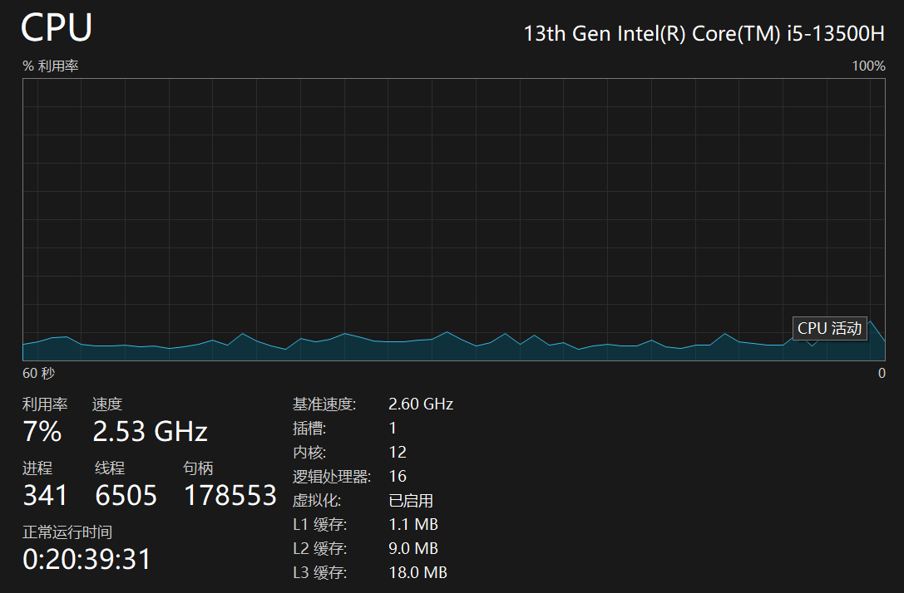
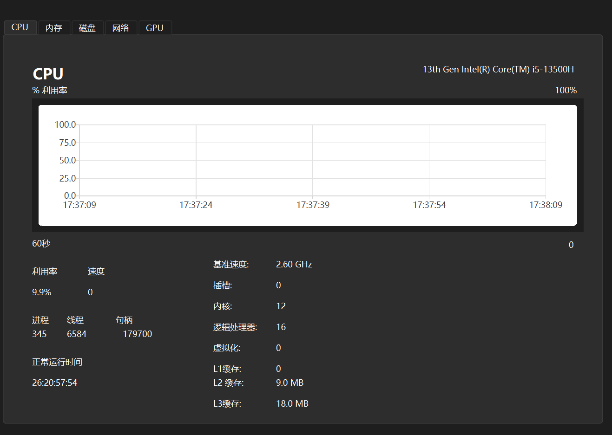

# 语言 | Language

​		 [中文](#中文) \|  [English](#english) 

---

### 中文

# 简介

技术选型：PySide6

仿照对象：windows任务管理器

重要描述：主要目的是学习pyside6，当然目前还在追求实现功能中(小白一只，只会调库，暂不会自研)，把能直接完成的尽快完成，然后重点优化排版与样式

预期功能：

1. CPU:
   - 获取cpu名称 - [&#10004;] 
   - 实时cpu利用率 - [&#10004;]
   - 实时获取cpu速度 - [&#10008;]
   - 实时获取进程数 - [&#10004;]
   - 实时获取线程数 - [&#10004;]
   - 实时获取句柄数 - [&#10004;]
   - 获取系统正常运行时间 - [&#10008;]
   - 获取cpu基准速度 - [&#10004;]
   - 获取cpu插槽数 - [&#10008;]
   - 获取cpu内核数 - [&#10004;]
   - 获取cpu逻辑处理器数 - [&#10004;]
   - 获取虚拟化信息 - [&#10008;]
   - 获取L1缓存 - [&#10008;]
   - 获取L2缓存 - [&#10004;]
   - 获取L3缓存 - [&#10004;]

存在问题：

目前来说，在获取 进线程数量以及句柄数量时，API的调用会造成卡顿。完全比不上任务管理器的丝滑。

当然还有一大堆问题亟待解决，如何利用python获取完整的硬件信息我还在寻找库中，目前psutil 和 wmi 库貌似只能提供主要数据，有些数据就无法获取。

目标图(Win11任务管理器)：

实际图：

2. 内存：
   - 实时内存使用量 - [&#10008;]	
   - 实时内存组合 - [&#10008;]
   - 已提交 - [&#10008;]
   - 已缓存 - [&#10008;]
   - 分页缓冲池 - [&#10008;]
   - 非分页缓冲池 - [&#10008;]
   - 内存速度 - [&#10008;]
   - 已使用插槽数 - [&#10008;]
   - 外形规格 - [&#10008;]
   - 为硬件保留的内存 - [&#10008;]
3. 磁盘:
   - 磁盘名称 - [&#10008;]
   - 磁盘处理请求的时间百分比 - [&#10008;]
   - 磁盘传输速率 - [&#10008;]
   - 活动时间 - [&#10008;]
   - 平均响应时间 - [&#10008;]
   - 读取速度 - [&#10008;]
   - 写入速度 - [&#10008;]
   - 容量 - [&#10008;]
   - 已格式化大小 - [&#10008;]
   - 是否系统磁盘 - [&#10008;]
   - 是否页面文件 - [&#10008;]
   - 磁盘类型 - [&#10008;]
4. WIFI:
   - 网卡名称 - [&#10008;]
   - 吞吐量 - [&#10008;]
   - 发送 - [&#10008;]
   - 接收 - [&#10008;]
   - 适配器名称 - [&#10008;]
   - SSID - [&#10008;]
   - 连接类型 - [&#10008;]
   - IPV4 - [&#10008;]
   - IPV6 - [&#10008;]
   - 信号强度 - [&#10008;]
5. GPU:
   - GPU名称 - [&#10008;]
   - 3D - [&#10008;]
   - Copy - [&#10008;]
   - Video Decode - [&#10008;]
   - Video Processing - [&#10008;]
   - 共享GPU内存 - [&#10008;]
   - 实时利用率 - [&#10008;]
   - GPU内存 - [&#10008;]
   - 驱动版本 - [&#10008;]
   - 驱动日期 - [&#10008;]
   - DirectX版本 - [&#10008;]
   - 物理位置 - [&#10008;]

---

### English

没有英文版，就意思意思。